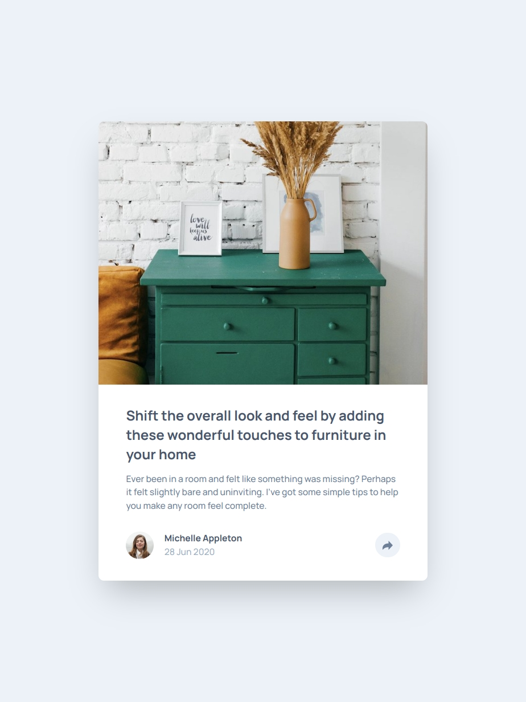

# Frontend Mentor - Article preview component solution

This is a solution to the [Article preview component challenge on Frontend Mentor](https://www.frontendmentor.io/challenges/article-preview-component-dYBN_pYFT). Frontend Mentor challenges help you improve your coding skills by building realistic projects. 

## Table of contents

- [Frontend Mentor - Article preview component solution](#frontend-mentor---article-preview-component-solution)
  - [Table of contents](#table-of-contents)
  - [Overview](#overview)
    - [The challenge](#the-challenge)
    - [Screenshot](#screenshot)
    - [Links](#links)
  - [My process](#my-process)
    - [Built with](#built-with)
    - [What I learned](#what-i-learned)
    - [Continued development](#continued-development)
    - [Useful resources](#useful-resources)
  - [Author](#author)
  - [Acknowledgments](#acknowledgments)


## Overview

### The challenge

Users should be able to:

- View the optimal layout for the component depending on their device's screen size
- See the social media share links when they click the share icon

### Screenshot





### Links

- Solution URL: [GitHub](https://github.com/Adamskiee/article-preview-component)
- Live Site URL: [Website](https://adamskiee.github.io/article-preview-component/)

## My process

### Built with

- Semantic HTML5 markup
- CSS custom properties
- Flexbox
- CSS Grid
- Mobile-first workflow
- Javascript
- [Tailwind](https://tailwindcss.com/) - CSS Frameworks

### What I learned
1. Layer components
```css
@layer components {
// ...existing code...
}
```

2. Interactivity
```js
// ...existing code..
const desktopWidth = window.matchMedia("(min-width: 1439px)");

shareBtn.addEventListener('click', () => {
    if(desktopWidth.matches) {
        desktopShareMenu.classList.toggle("hidden");
        shareBtn.classList.toggle("focus-share-btn");
    } else {
        mobileShareMenu.classList.toggle("hidden");
    }
});
// ...existing code...
```

3. Filtering image
```css
  .content__share:hover > img,
  .focus-share-btn > img {
    @apply brightness-0 invert-[1];
  }
```

4. Customizing image
```css
.card__image {
  @apply rounded-t-lg max-w-full w-full h-[12.5rem] object-cover object-[100%_25%] desktop:h-full desktop:object-left desktop:rounded-t-none desktop:rounded-s-lg md:h-auto;
}
```

### Continued development

1. I want to learn how can I reduce redundancy on my code.
2. I want to learn how can I effectively manipulate an svg file.
3. I want to explore more on how can i make the website interactive.

### Useful resources

- VSCode Github Copilot - This help me to explore some possibilities of what I want to achieve and what is the best in those situations.
- [W3schools](w3schools.com) - This is an amazing website which helped me to customize and filter image.

## Author

- Frontend Mentor - [@Adamskiee](https://www.frontendmentor.io/profile/Adamskiee)

## Acknowledgments
I want to acknowledge **GitHub Education** because of its student pack which helped me to pursue Web Development.